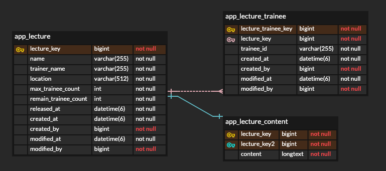
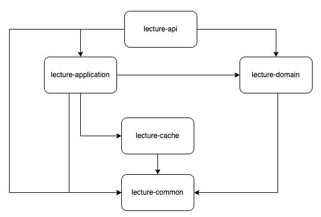
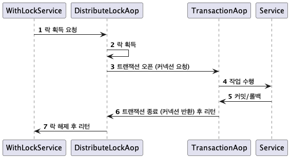
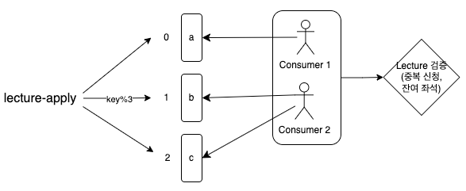
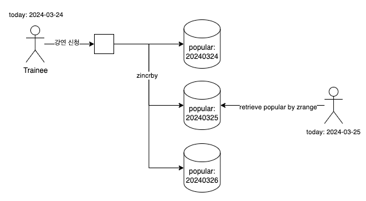
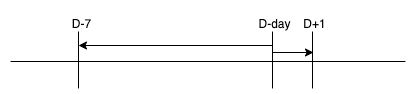
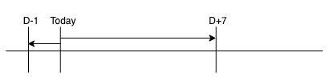

## Github
https://github.com/dlxotn216/assignment_lecture/blob/master/README.md

## 프로젝트 개요
### 요구사항
* 직원들의 경험을 위해 유명 강연자를 초빙한 강연 정보, 강연 신청 등을 관리하는 플랫폼의 Backend API 구현
* 강연장에 입장 가능한 인원 수는 강연마다 상이 함
* 강연신청 목록은 강연 시작 1주일 전, 시작 시간 1일 후 노출 됨
* 실시간 인기 강연은 3일간 가장 신청이 많은 강연 순으로 노출 됨
* 강의 신청은 중복 신청이 불가능
* 인기 강연의 경우 강연 신청 시 동시성을 고려 해야 함

## 개발 언어 및 프레임워크
### 개발 환경
* kotlin (1.9.22)
* jdk (17)
* Spring Boot (3.2.3)
* spring WebMVC
* Spring Data JPA
* Spring Data Redis

### Testing
* Junit5
* MockK
* Fixture monkey

### Persistence
* MySQL

### Cache
* Redis
* Redisson client

## 프로젝트 실행
### 사용한 도커 컨테이너
```shell
docker run -p 16379:6379 -d redis:7.2.4 redis-server --requirepass "password"
docker run -p 3306:3306 -e MYSQL_ROOT_PASSWORD=password -e MYSQL_DATABASE=lectures -d mysql:8.0.36 --character-set-server=utf8mb4 --collation-server=utf8mb4_unicode_ci
```

### Profile
* test
  * 테스트 용 프로파일로 schema.sql을 통해 테이블 초기화
* local
  * 로컬 환경에서 사용하는 프로파일로 스키마 validate 

## 데이터 설계 
* 요구사항의 강연 데이터(강연자, 강연장, 신청 인원, 강연 시간, 강연 내용) + 강연 이름, 잔여 지원자 수를 관리하는 lecture 테이블 설계
* '강연 내용'에 자유 형식 데이터를 고려하여 longtext 타입 사용. disk io 고려, 필요한 경우에만 불러오도록 별도의 테이블로 분리 
* 강연 신청을 관리하기 위한 app_lecture_trainee 테이블 추가
* 별도로 사용자에 대한 테이블은 두지 않고 사번(trainee_id)을 저장

  
[전체 스키마 파일](lecture-domain%2Fsrc%2Fmain%2Fresources%2Fschema.sql)

## 엔티티 설계
* Lecture, LectureContent는 OneToOne 관계이나 lazy fetch가 가능하도록 OneToMany로 연관관계 매핑
```kotlin
class Lecture(
    val lectureKey: Long,
) {
    @OneToMany(
        fetch = FetchType.LAZY, cascade = [CascadeType.PERSIST, CascadeType.MERGE, CascadeType.REFRESH],
        mappedBy = "lecture"
    )
    private val _contents: MutableSet<LectureContent> = mutableSetOf()
    private val content get() = _contents.firstOrNull()
    val contentValue get(): String = content?.content ?: ""
}
```
* Lecture, LectureTrainee는 OneToMany 관계이나 불필요한 entity load를 방지하기 위해 연관관계 미설정
  * lecture.apply(traineeId)에서 trainee 컬렉션을 로드하는 것을 방지  


## 프로젝트 설계
### Module 설계
  
* lecture-common
  * 프로젝트 전반에서 사용할 설정, 유틸, 예외, VO 등을 정의
  * Jackson, I18n, DistributeLock 등을 위한 추상화
* lecture-domain
  * application 패키지
    * 트랜잭션 등 프레임워크 지원이 필요한 로직 구현
  * domain 패키지
    * Spring Data JPA 기반 도메인 Entity를 통해 주요 로직 구현
  * infra 패키지
    * 검색 등 외부 인프라를 사용하는 로직 구현
  * 추후 확장성을 위해 EntityRepository와 SearchRepository를 분리
  * textFixtures를 통해 다른 모듈에서 사용할 테스트 fixture 공유
* lecture-service
  * RDBMS 외의 infra를 요구하는 로직을 처리
* lecture-api
  * lecture-service, lecture-domain를 통해 API serving
* lecture-cache
  * 캐시를 사용하는 로직을 처리
    * DistributeLock 추상화에 대한 구현 
  * Redis client 구현체 캡슐화

### Request context
* 사용자 요청 시 언어 정보, 타임존 정보를 관리하기 위해 RequestContext 클래스를 정의
* RequestContextResolver를 통해 NativeWebRequest에서 RequestContext를 추출
* 테스트 지원을 위해 (Real/Mock)RequestContextResolver로 분리

### 동시성 구현
* 강연 신청/취소 시, 잔여 지원자 수를 증가/감소시키는 로직에서 동시성 문제를 해결하기 위해 Redis 기반 분산락을 사용
  * MySQL의 named lock을 활용할 수 있으나 Redis가 이미 테크 스택에 포함되어 있어 Redis를 활용
* Redisson 클라이언트를 통해 분산락 획득 시 스핀락 방지
* AcquireDistributeLock 어노테이션을 통해 AOP 기반 분산락 설계
  * SpEL을 통해 락 키를 동적으로 관리
* 분산락 획득 AOP와 Transaction AOP의 순서를 고려하여 분산락을 획득한 스레드에서 커넥션을 점유하도록 처리  
  * 트랜잭션을 열고 락을 시도하는 스레드와 락을 획득하고 트랜잭션을 위한 커넥션을 기다리는 스레드 간의 경합을 방지


#### 동시성 구현 개선 방향
* Redisson을 사용하여 스핀락은 방지할 수 있으나 여전히 요청 스레드가 대기하는 낭비 발생
* Lock에 설정된 타임아웃으로 락 획득 후 네트워크 지연 등에 의해 예기치 못한 정합성 오류 발생 가능성
  * 트랜잭션이 늦게 완료되어 락 타입아웃이 발생, 다른 스레드가 락 획득 후 추가 강연 신청 성공 가능성 
* 강연 신청/취소에 따른 즉각적인 반영이 필요 없다면(Eventually consistency가 허용 된다면) 이벤트 기반으로 락 없이 처리하는 방향으로 개선


### 실시간 인기 강연
* Redis Sorted set 자료구조를 활용하여 랭킹 구현
* zincrby 명령어를 통해 강연 신청/취소 시, 강연의 신청수를 증가/감소 
```redis
zincrby popular-lecture:{date} 1 {lecture_key}
```
* 3일간 인기 강연을 관리 하기 위해 현재 기준 +1일 +2일 Sorted set에도 같이 저장 하도록 처리
  * RTT 낭비를 줄이기 위해 Lua script 사용
* 실시간 인기 강연 조회는 오늘 날짜의 Sorted set을 조회하여 랭킹을 표시


### 강연 목록 노출
* 노출 가능한 강연 목록은 강연 시작일로부터 7일 전 혹은 강연 시작일로부터 하루 후
* (releasedAt - 7 <= now or now <= releasedAt +1)으로 조건식을 구성할 경우 인덱스가 타지 않음

* 위 조건을 오늘 날짜 기준으로 변환
* (now -1 <= releasedAt <= now + 7) 


## API Specification
### 강연 등록 
<details>
 <summary><code>POST /api/v1/lectures</code></summary>

#### 요청 Body
```json
{
  "name": "Spring boot 3.0",
  "location": "서울시 마포구",
  "releasedAt": "2024-03-24T12:00:00",
  "trainer": "Trainer",
  "maxTraineeCount": 100,
  "content": "..."
}
```

#### 201 성공 응답
```json
{
    "result": {
        "lectureKey": 5
    },
    "requestContext": {
        "supportLang": "KOREAN",
        "zoneId": "Asia/Seoul",
        "nowDateTime": "2024-03-24T16:35:13.466622",
        "nowDate": "2024-03-24"
    },
    "message": "요청이 성공했습니다."
}
```
#### 4xx 실패 응답
```json
{
    "errorInfo": {
        "errorCode": "INVALID_RELEASE_AT"
    },
    "message": "유효하지 않은 강연 시작일입니다."
}
```
</details>

### 전체 강연 목록 조회 (Back office)
<details>
 <summary><code>GET /api/v1/lectures</code></summary>

#### 200 성공 응답
```json
{
    "result": {
        "contents": [
            {
                "lectureKey": 5,
                "name": "name_1cbc9e78fce5",
                "maxTraineeCount": 3,
                "remainTraineeCount": 3,
                "releasedAt": "2024-03-26T09:10:32",
                "key": 5
            }
        ],
        "isFirst": true,
        "isLast": true,
        "size": 10,
        "hasNext": false,
        "isEmpty": false,
        "lastKey": 1
    },
    "requestContext": {
        "supportLang": "KOREAN",
        "zoneId": "Asia/Seoul",
        "nowDateTime": "2024-03-24T16:37:45.154018",
        "nowDate": "2024-03-24"
    },
    "message": "요청이 성공했습니다."
}
```
</details>

### 강연 신청 목록 조회 (Back office)
<details>
 <summary><code>GET /api/v1/lectures/trainees</code></summary>

#### 200 성공 응답
```json
{
    "result": {
        "contents": [
            {
                "lectureTraineeKey": 13,
                "lectureKey": 1,
                "name": "lecture 1",
                "traineeId": "00006",
                "applyAt": "2024-03-24T16:19:30.046001",
                "key": 13
            }
        ],
        "isFirst": true,
        "isLast": false,
        "size": 10,
        "hasNext": true,
        "isEmpty": false,
        "lastKey": 4
    },
    "requestContext": {
        "supportLang": "KOREAN",
        "zoneId": "Asia/Seoul",
        "nowDateTime": "2024-03-24T16:26:42.042137",
        "nowDate": "2024-03-24"
    },
    "message": "요청이 성공했습니다."
}
```
</details>


### 신청 가능 강연 목록 조회 (Front)
<details>
 <summary><code>GET /api/v1/available-lectures</code></summary>

#### 200 성공 응답
```json
{
    "result": {
        "contents": [
            {
                "lectureKey": 5,
                "name": "name_1cbc9e78fce5",
                "maxTraineeCount": 3,
                "remainTraineeCount": 3,
                "releasedAt": "2024-03-26T09:10:32",
                "key": 5
            }
        ],
        "isFirst": true,
        "isLast": true,
        "size": 10,
        "hasNext": false,
        "isEmpty": false,
        "lastKey": 1
    },
    "requestContext": {
        "supportLang": "KOREAN",
        "zoneId": "Asia/Seoul",
        "nowDateTime": "2024-03-24T16:37:17.625694",
        "nowDate": "2024-03-24"
    },
    "message": "요청이 성공했습니다."
}
```
</details>

### 신청 내역 목록 조회 (Front)
<details>
 <summary><code>GET /api/v1/trainees/{traineeId}/lectures</code></summary>

#### 200 성공 응답
```json
{
    "result": {
        "contents": [
            {
                "lectureTraineeKey": 2,
                "lectureKey": 3,
                "name": "lecture 3",
                "applyAt": "2024-03-24T16:19:29.991729",
                "key": 2
            }
        ],
        "isFirst": true,
        "isLast": true,
        "size": 10,
        "hasNext": false,
        "isEmpty": false,
        "lastKey": 2
    },
    "requestContext": {
        "supportLang": "KOREAN",
        "zoneId": "Asia/Seoul",
        "nowDateTime": "2024-03-24T16:30:42.542166",
        "nowDate": "2024-03-24"
    },
    "message": "요청이 성공했습니다."
}
```
</details>

### 인기 강연 목록 조회 (Front)
<details>
 <summary><code>GET /api/v1/popular-lectures</code></summary>

#### 200 성공 응답
```json
{
    "result": [
        {
            "lectureKey": 2,
            "name": "lecture 2",
            "maxTraineeCount": 20,
            "remainTraineeCount": 14,
            "releasedAt": "2024-03-26T16:19:29.956",
            "key": 2
        },
        {
            "lectureKey": 3,
            "name": "lecture 3",
            "maxTraineeCount": 20,
            "remainTraineeCount": 18,
            "releasedAt": "2024-03-26T16:19:29.956",
            "key": 3
        }
    ],
    "requestContext": {
        "supportLang": "KOREAN",
        "zoneId": "Asia/Seoul",
        "nowDateTime": "2024-03-24T16:33:16.078426",
        "nowDate": "2024-03-24"
    },
    "message": "요청이 성공했습니다."
}
```
</details>

### 강연 신청 (Front)
<details>
 <summary><code>POST /api/v1/lectures/{lectureKey}/trainees/{traineeId}</code></summary>

#### 204 No content
</details>

### 강연 신청 취소 (Front)
<details>
 <summary><code>DELETE /api/v1/lectures/{lectureKey}/trainees/{traineeId}</code></summary>

#### 204 No content
</details>
